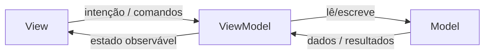

# MVVM Architecture

View renderiza e encaminha intenção. ViewModel orquestra estado e casos de uso. Model encapsula dados e regras de domínio/infra.

## Responsabilidades

| Camada | Faz | Não faz |
|--------|-----|---------|
| **View** | Bindings, layout, eventos de UI | Regras de negócio, I/O direto, parsing de API |
| **ViewModel** | Estado observável, comandos, transformação para UI | Know-how de widgets/cores/navegação visual detalhada |
| **Model** | Entidades, repositórios, services | Conhecer a View |

## Fluxo

1. View dispara comando (tap, submit, appear).
2. ViewModel valida, chama use cases/repositórios.
3. ViewModel atualiza estado (loading / success / error).
4. View reage ao estado sem lógica de negócio.

## Estado

- Exponha estado como snapshot imutável ou propriedades observáveis claras.
- Modele UI state com unions: `idle | loading | ready(data) | failed(error)`.
- Evite estado duplicado entre View e ViewModel.
- Side effects (navigation, toast) via eventos/efeitos consumidos uma vez, não flags esquecidas.

## Dependências

- Injete repositórios/services no ViewModel (construtor/factory).
- View cria/obtém ViewModel via container, wrapper de ambiente ou factory do projeto.
- ViewModels não importam frameworks de UI além do mínimo de tipos de apresentação.

## Testabilidade

- Unit teste ViewModels com Model fake/mock.
- Teste policies e transformações sem subir a UI.
- Views: smoke/UI tests finos; lógica pesada já coberta no ViewModel.

## Adaptação por stack

- **SwiftUI**: `Observable` / `@Observable`, `@State`, `@Environment`; ViewModel sem referenciar `View` concreta.
- **React / RN**: ViewModel como store/hook de feature (`useXViewModel`) separado de JSX presentacional.
- **Android**: ViewModel oficial + UiState; sem Context de View.

## Anti-padrões

- Massive View com networking
- ViewModel que formata HTML/SwiftUI View builders complexos
- Model que importa pacotes de UI
- God ViewModel para a tela inteira do app
- Callbacks bidirecionais emaranhados sem estado único

## Critérios de conclusão

- Fronteiras View / ViewModel / Model claras nos arquivos tocados
- Estado de UI modelado e testável
- I/O isolado atrás de interfaces/repositórios
- Views magras; ViewModels sem dependência de widgets
- Testes de ViewModel para o fluxo principal da feature
